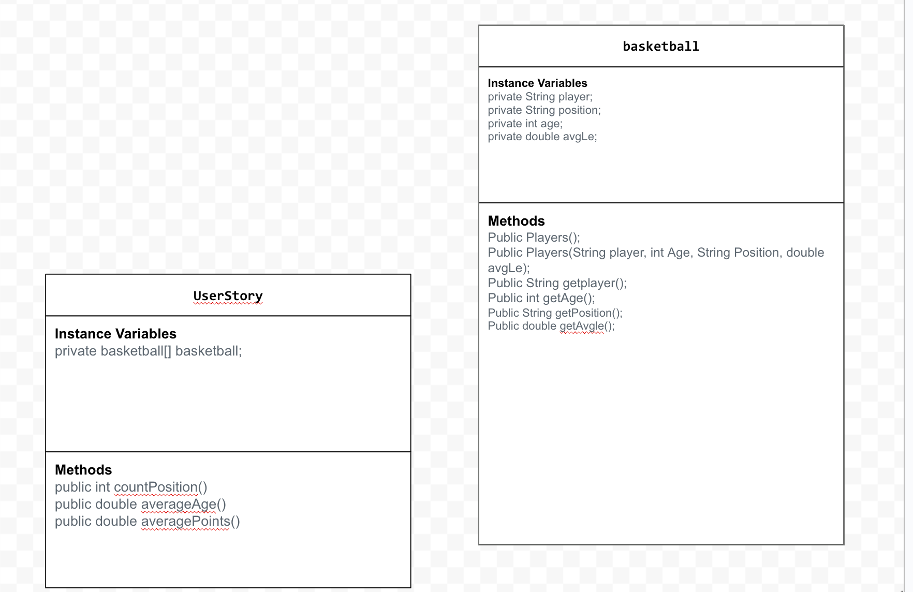

# Data-for-Social-Good

Introduction:
Software engineers develop programs to work with data and provide information to a user. Each user has different needs based on the information they are looking for from data. Your goal is to create a data analysis program for your user that stores and analyzes data to provide the information they need.

Use your knowledge of object-oriented programming, one-dimensional (1D) arrays, and algorithms to create your data analysis program:
- **Write a class** – Write a class to represent your user or business and store and analyze their data with no-argument and parameterized constructors.
- **Create at least two 1D arrays** – Create at least two 1D arrays to store the data that your user needs information about.
- **Write a method** – Write a method that finds or manipulates the elements in a 1D array to provide the information your user needs.
- **Implement a toString() method** – Write a toString() method that returns general information about the data (for example, number of values in the dataset).
- **Document your code** – Use comments to explain the purpose of the methods and code segments and note any preconditions and postconditions.

As a NBA Enthusiast, we wanted to analyze the NBA so that we can find out different players and their stats throughout the playoffs. 

Dataset: https://www.kaggle.com/datasets/vivovinco/nba-player-stats

Points = Number of points scored on average per play off game.
Games Played = Amount of Games Played
Assists = Assists per game.

Our project will give NBA stats based on which player you ask to see the stats of. These stats are based off the 21-22 playoffs and based on each player and how they played. The user gets the information needed and is satisfied with using our app. 

